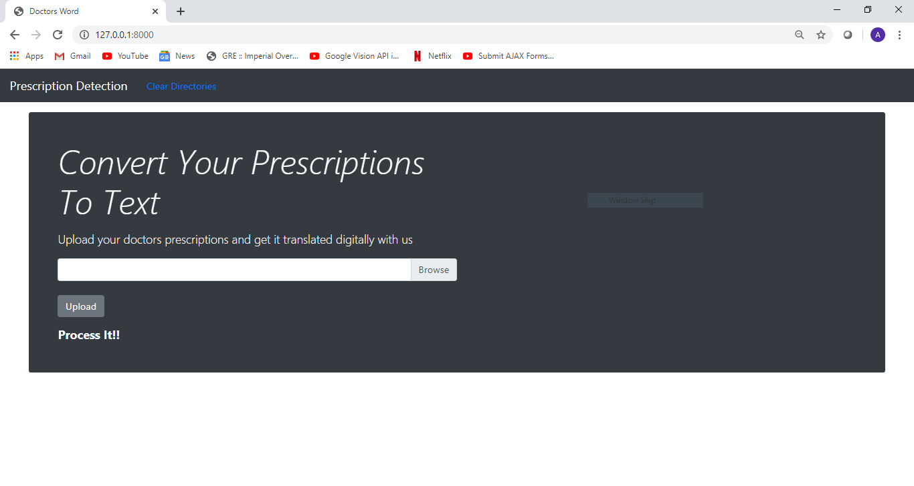
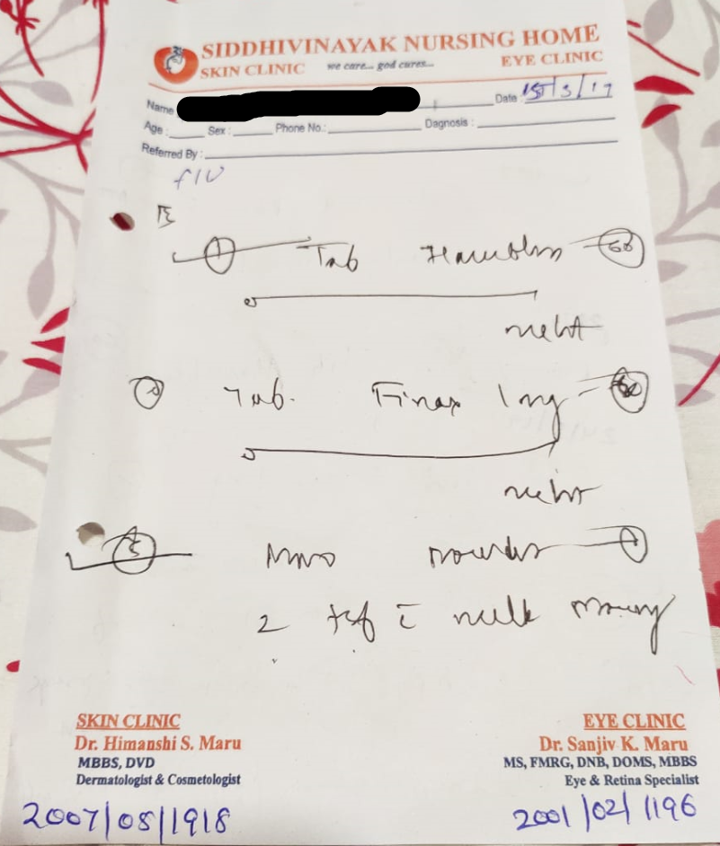
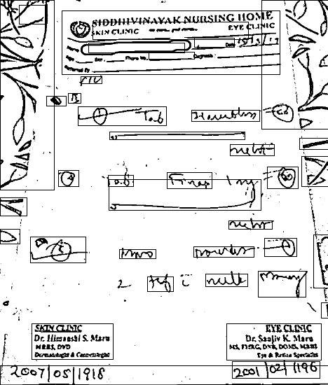
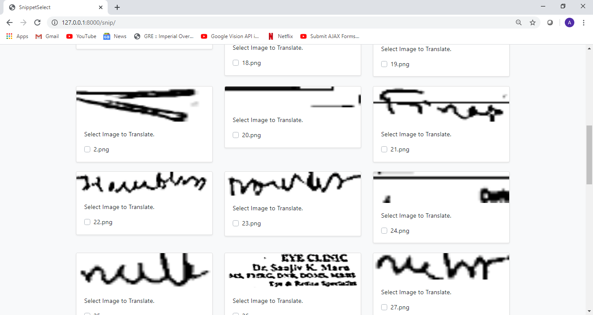
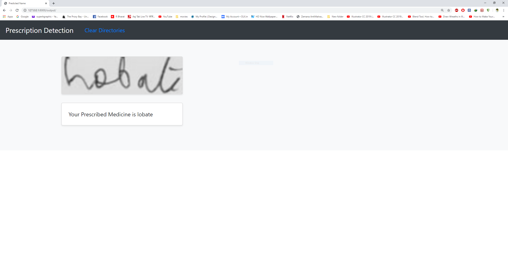
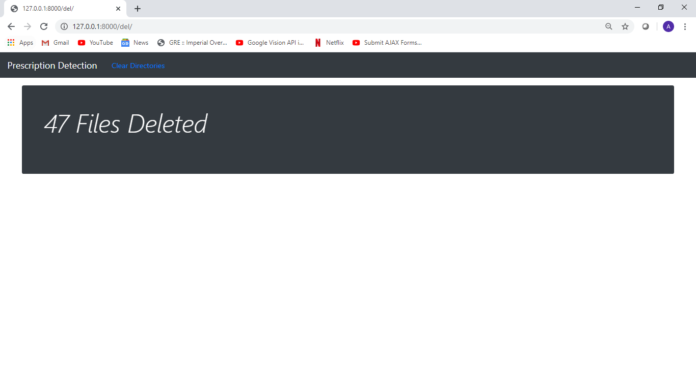

# DoctorsPrescription
### A simple project to detect the medicine on a prescription 

#### The program uses supervised learning using CNN and front end built using Django 

### The UI for the Project is shown down below

### Home Screen

### Example Prescription

### Segmented Prescription

### Select desired text

### Select desired text

### Deleting files once used

